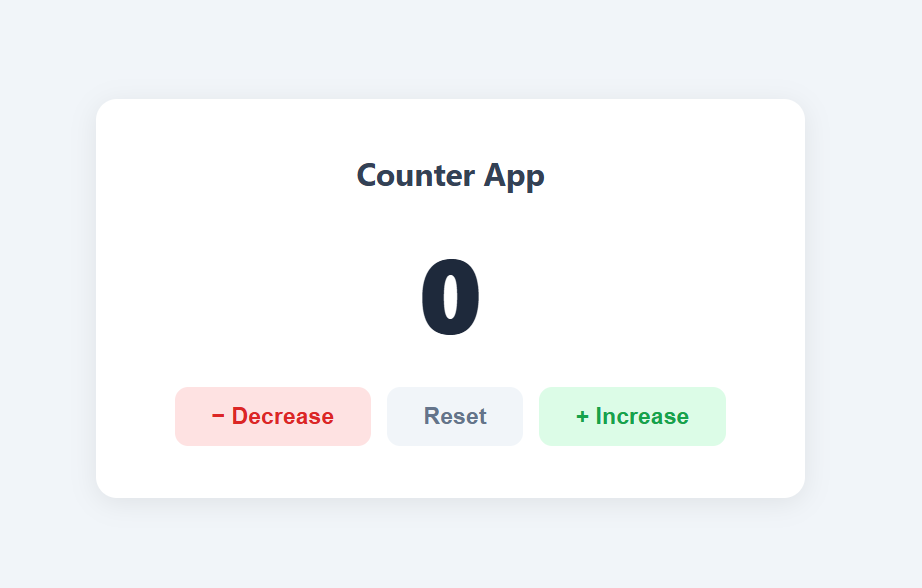

# Counter-app
A simple and elegant counter application built using **HTML, CSS, and JavaScript**.

## ✨ Features
- ➕ Increase counter
- ➖ Decrease counter
- 🔄 Reset counter
- 🎨 Dynamic color change:
  - Green → Positive values
  - Red → Negative values
  - Default → Zero
- 💻 Clean and responsive UI

## 🛠️ Tech Stack
- HTML5
- CSS3
- JavaScript (Vanilla)

## 📸 Preview
## 📸 Preview

## 🚀 Live Demo
👉 https://your-username.github.io/taptally/

## 📂 Project Structure
